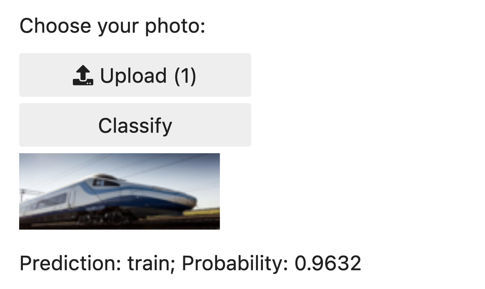

# MLImageLab

MLImageLab is an interactive image-based transport recognition app. Upload a photo and instantly identify the type of transport: ship, plane, train, or bus using a custom-trained AI model.

## Features

- Automatic download of 100 images for each transport type (ship, plane, train, bus)
- Model training and recognition powered by [fastai](https://docs.fast.ai/)
- Simple web interface for uploading and classifying images
- Run locally with [Voila](https://voila.readthedocs.io/en/stable/) for interactive use

## Getting Started

1. Make sure you have Voila and fastai installed in your Python environment.
2. Run the following command in your project directory: 
    voila program.ipynb
3. The web interface will open in your browser. Upload an image to see the transport type prediction.

## Example

Here's an example of the application in action:

The model correctly identifies the transport type with high confidence.

## Third-party Licenses

The project uses the following third-party libraries:

- fastai — Apache License 2.0. Source: https://github.com/fastai/fastai
- Voila — BSD License. Source: https://github.com/voila-dashboards/voila
- ddgs — MIT License. Source: https://github.com/deedy5/ddgs
- Pillow (PIL) — HPND License. Source: https://github.com/python-pillow/Pillow
- requests — Apache License 2.0. Source: https://github.com/psf/requests
